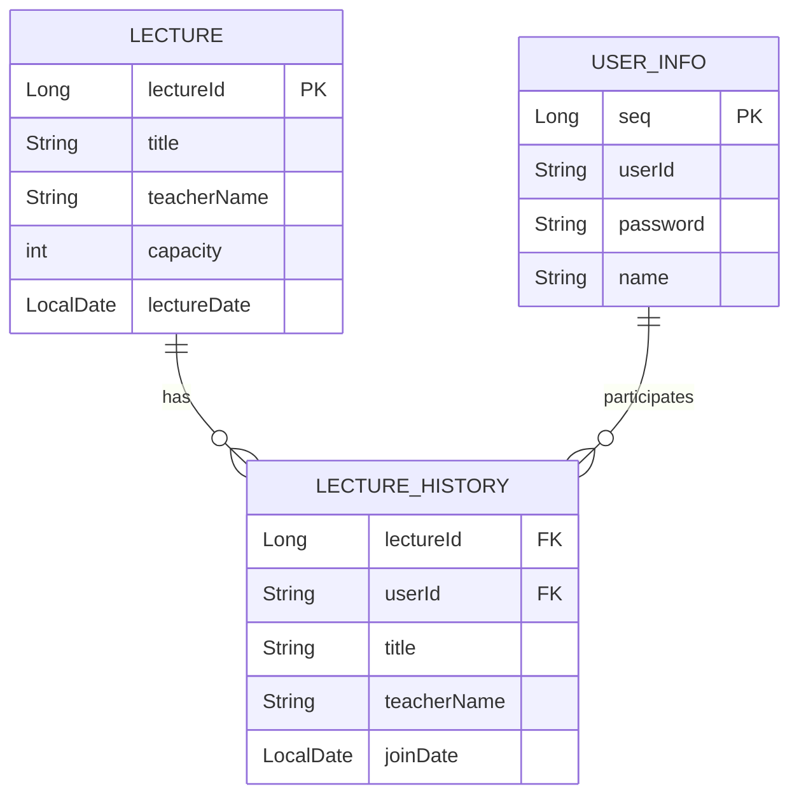

1. Lecture 테이블:
lectureId (PK, Long, 자동 생성)
title (String, 강의 제목)
teacherName (String, 강사 이름)
capacity (int, 강의 정원)
lectureDate (LocalDate, 강의 날짜)

2. LectureHistory 테이블:
lectureId (Long, 외래 키로 추정 가능)
userId (String, 외래 키로 추정 가능)
title (String, 강의 제목)
teacherName (String, 강사 이름)
joinDate (LocalDate, 참여 날짜)

3. User 테이블:
seq (PK, Long, 자동 생성)
userId (String, 사용자 ID)
password (String, 비밀번호)
name (String, 사용자 이름)

ERD 구조:
Lecture는 강의에 대한 정보를 저장합니다. 기본적으로 강의 제목, 강사 이름, 정원, 강의 날짜 등을 포함하고 있습니다.
User는 사용자에 대한 정보를 저장합니다. 각 사용자는 고유의 userId를 가지고 있으며, 비밀번호와 이름을 저장합니다.
LectureHistory는 사용자가 어떤 강의에 참여했는지를 기록하는 테이블로, lectureId와 userId를 통해 각각 강의와 사용자 테이블과 관계를 맺고 있습니다. 이 테이블은 강의 참여 내역을 관리합니다.

관계:
Lecture와 LectureHistory는 1
관계로 연결됩니다. 한 강의에 여러 사용자가 참여할 수 있기 때문에, 한 강의(Lecture)는 여러 참여 내역(LectureHistory)을 가질 수 있습니다.
User와 LectureHistory 역시 1
관계입니다. 한 사용자는 여러 강의에 참여할 수 있으므로, 하나의 사용자(User)는 여러 참여 내역(LectureHistory)을 가질 수 있습니다.
